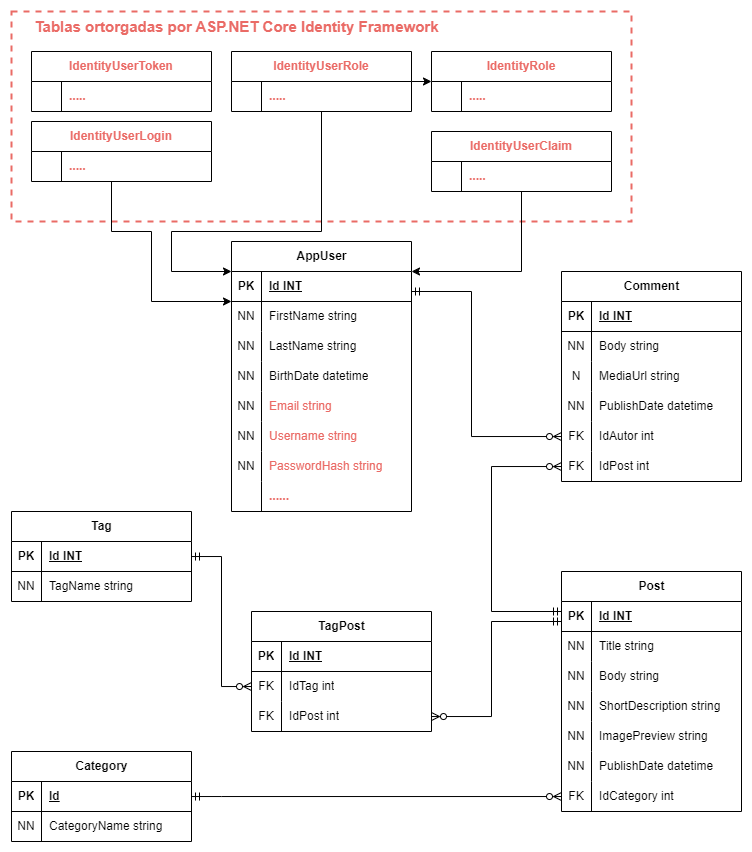

# Proyecto: Blog Personal | TecnoFit 

## Descripción del Proyecto

Este es un blog personal dedicado a compartir contenido sobre entrenamiento físico y tecnología. El blog ofrece artículos, los cuales podrian contener tutoriales y consejos, relacionados con el fitness, así como temas tecnológicos como desarrollo de software y programación.

El objetivo principal de este blog es proporcionar un espacio donde los entusiastas del fitness y la tecnología puedan encontrar información valiosa y aprender nuevas habilidades basadas en la experiencia propia.

[Ver Demo](https://tecnofit.somee.com/)
## Características Principales

- **Publicación de Artículos**: Los usuarios pueden leer artículos sobre entrenamiento y tecnología.
- **Comentarios**: Los usuarios pueden comentar en los artículos y subir imágenes en los mismos.
- **Categorización**: Los artículos están categorizados para facilitar la búsqueda por temas de interés.
- **Galería de Imágenes**: Los artículos pueden incluir imágenes, las cuales son almacenadas de manera segura en la nube.
- **Resaltado de Código**: Los artículos cuentan con fragmentos de código para facilitar la accesibilidad visual a los mismos, utilizando CKEditor para el formato.

## Tecnologías Utilizadas

### Frontend

- **Lenguajes y Herramientas**: HTML, CSS, JavaScript, jQuery, Razor.
- **Framework CSS**: Tailwind CSS.
- **Editor de Diseño**: Figma, para la creación de diseños y prototipos.

### Backend

- **Framework**: ASP.NET Core MVC.
- **Lenguaje de Programación**: C#.
- **ORM**: Entity Framework Core (EF Core) para el mapeo de clases a tablas de base de datos, utilizando el enfoque "Code First".
- **Base de Datos**: SQL Server.

### APIs Externas

- **Envío de Correos**: Integración con SendGrid para el envío de correos electrónicos a los suscriptores.
- **Subida de Imágenes**: Uso de Cloudinary para la gestión y almacenamiento seguro de imágenes en la nube.

### Deploy
  - El proyecto esta desplegado en [**Somee**](https://somee.com/)

### Autenticación y Autorización

- Implementación de autenticación de usuarios mediante cookies y autorización basada en roles, ambas proporcionadas por ASP.NET Core Identity Framework.

## Descripción de Flujo de Datos


- Interacción Usuario-Frontend:
  1. El usuario accede al blog a través de su navegador.

  1. El frontend renderiza las páginas HTML utilizando ASP.NET Core MVC y Razor.

- Llamadas al Backend:
  1. Cuando un usuario realiza acciones como leer un artículo, comentar o subir una imagen, el frontend envía solicitudes al backend (ASP.NET Core).

  1. El backend maneja estas solicitudes, ejecuta la lógica de negocio necesaria, y responde al frontend.

-  Interacción con la Base de Datos:
   1. El backend utiliza Entity Framework Core para interactuar con SQL Server.

   1. Las operaciones CRUD (Crear, Leer, Actualizar, Eliminar) sobre artículos, comentarios, y usuarios se manejan aquí.

- Comunicación con Servicios Externos:
  - Para acciones específicas, el backend interactúa con APIs externas.

  1. SendGrid: Envío de correos electrónicos para la sección de contacto.

  1. Cloudinary: Almacenamiento y gestión de imágenes de los articulos y comentarios. Cuando un usuario sube una imagen, esta se envía a Cloudinary, y se almacena la URL resultante en la base de datos.

## Proceso y Determinación de Entidades

- **Esquema Lógico**: Un diagrama que representa las entidades principales y su relación a nivel de lógica de negocio, sin especificar los atributos.
   

- **Diagrama Entidad-Relación (DER)**: Muestra las entidades y las relaciones entre ellas en la base de datos, detallando los atributos pero no el tipo de dato.
  

- **Diagrama Relacional**: Un modelo detallado de la base de datos, describiendo las tablas, atributos y claves primarias/foráneas.
  

## Cómo Ejecutar el Proyecto Localmente

1. **Clonar el repositorio**:
    ```bash
    git clone https://github.com/AbelMV29/BlogPersonal
    ```

2. **Configurar el entorno**:
    - Crear un archivo `appsettings.json` en la raíz del proyecto con las configuraciones de conexión a la base de datos y las claves API necesarias:
    ```json
    {
      "Logging": {
        "LogLevel": {
          "Default": "Information",
          "Microsoft.AspNetCore": "Warning"
        }
      },
      "AllowedHosts": "*",
      "ConnectionStrings": {
        "AppConnectionString": "tu cadena de conexión a la base de datos"
      },

      "CloudinarySettings": {
        "Cloud": "tu cloudName de cloudinary",
        "ApiKey": "tu apiKey",
        "ApiSecret": "tu apiSecret"
      },
      "AdminUser": { //configuración del usuario administrador
        "Email": "email@example.com",
        "FirstName": "tuNombre",
        "LastName": "tuApellido",
        "UserName": "tuNombreDeUsuario",
        "Password": "tuContraseña",
        "BirthDate": "tuFechaDeNacimiento"
      },
      "SendGridConfiguration": {
        "ApiKey": "tu api key para el envio de correos"
      }
    }
    ```

3. **Ejecutar las migraciones de la base de datos**:
    ```bash
    dotnet ef database update
    ```

4. **Iniciar la aplicación**:
    ```bash
    dotnet run
    ```
---